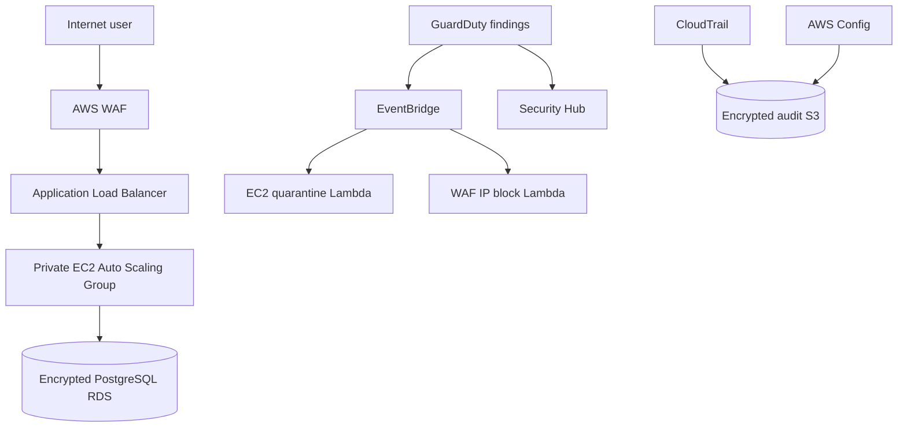

# SentinelAWS

Automated defense-in-depth and incident response for a highly available,
three-tier AWS application. This repository implements Project 8 of the Manara
AWS Solutions Architect Associate graduation project catalogue.

> Status: Phase 1 scaffold. The architecture and core Terraform modules are
> implemented. Deployment evidence will be added after the first AWS lab run.

## What this demonstrates

- Multi-AZ VPC with public, private application, and isolated database subnets
- Internet-facing Application Load Balancer and private EC2 Auto Scaling Group
- Multi-AZ-capable encrypted PostgreSQL RDS data tier
- AWS WAF managed rules, rate limiting, and a dynamic incident-response IP set
- Customer-managed KMS keys for application data, logs, and RDS credentials
- CloudTrail, AWS Config, GuardDuty, Security Hub, and VPC Flow Logs
- EventBridge-driven EC2 quarantine and WAF IP blocking workflows
- SSM Session Manager access with no inbound SSH rule or bastion host
- Terraform validation, Checkov scanning, and Python tests in GitHub Actions

## Architecture



The detailed trust boundaries and data flows are in
[`architecture/sentinelaws.mmd`](architecture/sentinelaws.mmd) and
[`docs/threat-model.md`](docs/threat-model.md).

## Repository layout

```text
architecture/                 Diagram sources
docs/                         Deployment, security, cost, and response guides
lambda/                       Automated containment functions
terraform/environments/dev/   Deployable development environment
terraform/modules/            Reusable infrastructure modules
tests/                        Lambda unit tests
.github/workflows/            CI validation and security scanning
```

## Safe deployment sequence

1. Use a dedicated AWS sandbox account. Do not deploy this lab in production.
2. Configure an AWS Budget before provisioning chargeable resources.
3. Copy `terraform.tfvars.example` to `terraform.tfvars` and set the owner and
   optional alert email.
4. Run `terraform init`, `terraform fmt -check`, `terraform validate`, and
   `terraform plan -out=tfplan`.
5. Review the plan, especially IAM, networking, and recurring-cost resources.
6. Apply the reviewed plan and confirm the SNS email subscription.
7. Execute only the simulations documented in `docs/incident-response.md`.
8. Capture evidence, then run `terraform destroy` when the lab is finished.

```bash
cd terraform/environments/dev
cp terraform.tfvars.example terraform.tfvars
terraform init
terraform fmt -recursive
terraform validate
terraform plan -out=tfplan
terraform apply tfplan
```

## Security constraints

- No SSH ingress is created. Administration uses Session Manager.
- The database has no public endpoint and only accepts traffic from the
  application security group.
- Automated containment acts only on resources tagged
  `SentinelAWSManaged=true`.
- The WAF automation accepts only valid public IPv4 addresses and never blocks
  RFC1918, loopback, link-local, multicast, or reserved ranges.
- Destructive identity actions and resource deletion are deliberately excluded
  from automation.

## Cost warning

NAT Gateway, Application Load Balancer, RDS, AWS Config, GuardDuty, Security
Hub, CloudTrail, and log ingestion can generate charges. Defaults
favor a short-lived lab, but they do not make it free. See
[`docs/cost-controls.md`](docs/cost-controls.md).

## Evidence required before calling this production-ready

- Successful Terraform plan and apply logs
- ALB health check and application response
- Private-subnet and no-SSH verification
- GuardDuty sample finding routed through EventBridge
- Tagged test-instance quarantine with recorded original security groups
- WAF IP insertion, audit record, and controlled removal
- Security Hub and Config results
- Successful destroy with retained evidence exported separately

## License

MIT
